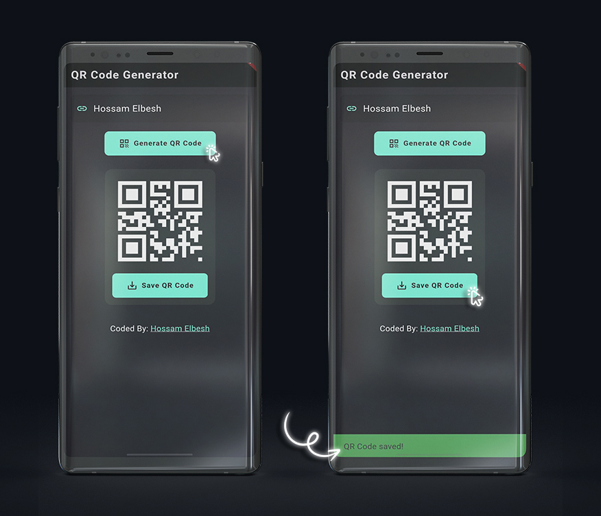

# QR Code Generator

A Flutter application that allows users to generate and save QR codes from input text or URLs. The app features animations and a sleek design to enhance the user experience.

## Features

- **Generate QR Codes**: Convert text or URLs into QR codes.
- **Save QR Codes**: Save generated QR codes to your device's gallery.
- **Responsive Design**: Adapts to different screen sizes.
- **Animations**: Includes button animations and QR code display transitions.
- **User-friendly Interface**: Dark theme with a modern design.



## Installation

1. **Clone the repository:**

   ```bash
   git clone https://github.com/HossamElbesh/QrCodeGen.git

A few resources to get you started if this is your first Flutter project:

- [Lab: Write your first Flutter app](https://docs.flutter.dev/get-started/codelab)
- [Cookbook: Useful Flutter samples](https://docs.flutter.dev/cookbook)

For help getting started with Flutter development, view the
[online documentation](https://docs.flutter.dev/), which offers tutorials,
samples, guidance on mobile development, and a full API reference.
